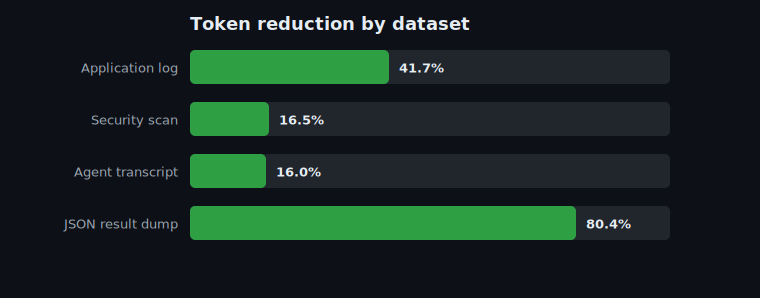

# Benchmarks

Generated by `python benchmarks/benchmark.py`. Token counts use the `tiktoken` backend.

| Dataset | Tokens before | Tokens after | Reduction | Time |
|---|--:|--:|--:|--:|
| Application log | 13,479 | 7,864 | **41.7%** | 29.6 ms |
| Security scan | 4,625 | 3,863 | **16.5%** | 10.6 ms |
| Agent transcript | 3,172 | 2,665 | **16.0%** | 7.9 ms |
| JSON result dump | 1,124 | 220 | **80.4%** | 1.0 ms |

**Average token reduction: 38.6%**

